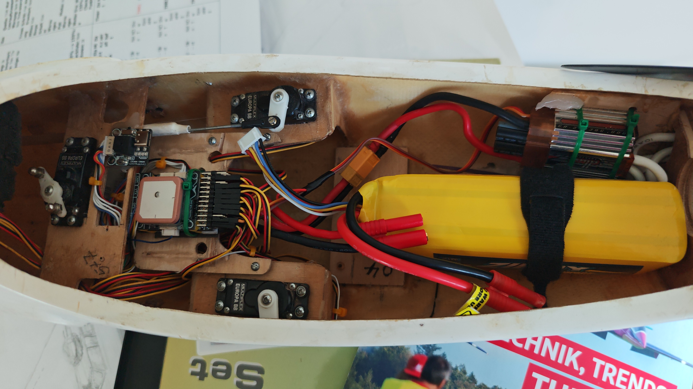

# Modell-Setup: ASW 27 (3,6m E-Segler)

### Ansicht der Anschlüsse und Verkabelung:

*Physischer Anschluss des FrSky-Empfängers (Kabel am unteren Rand, beeper Moduls und des GPS-Moduls am Flight Controller im eingebauten Zustand.*

## Die Besonderheiten und Flugfunktionen im Überblick

Für den Flugbetrieb wurden im iNAV-System folgende aerodynamische Schutzfunktionen 
und Automatismen konfiguriert:

* **Sicherheits-Priorität (Loiter & RTH):** Die Modi **NAV LOITER** (Kreisflug) 
  und **NAV RTH** (Heimkehr) auf **CH 7** haben absolute Priorität. Sie fangen 
  das Modell bei Raumlage- oder Sichtverlust auf Schalterdruck ab.

* **Erlaubtes Steigen:** Die Konfiguration erzwingt keine starre Flughöhe. 
  Findet der Heron im autonomen Kreisflug einen Aufwind, lässt das System es 
  zu, dass das Modell durch die reine Kraft der Thermik nach oben steigt.

* **Seitenruder-Mitnahme im Kreisflug:** Beim autonomen Kreisen (Loiter) steuert 
  das System das Seitenruder automatisch mit. Das verhindert ein Schieben des 
  Modells und unterstützt ein flaches Kreisen.

* **Schutz vor Strömungsabriss (Nase runternehmen):** Um ein Abkippen über die 
  Tragfläche (Stall) bei nachlassender Fahrt zu verhindern, nimmt die Software 
  automatisch die Nase leicht runter, um die Strömung aufrechtzuerhalten.

* **Manuelle Höhenanpassung im Automatikmodus (Tiefenruder):** Wenn das Modell 
  autonom fliegt (RTH oder Loiter), kann der Pilot über das Tiefenruder aktiv 
  eingreifen. Bei gedrücktem Tiefenruder sinkt das Flugzeug gezielt. Wird der 
  Knüppel losgelassen (Wegnehmen), stabilisiert sich der Heron sofort wieder 
  automatisch auf der aktuellen Höhe und das Sinken stoppt.

* **Manuelle Richtungskorrektur (Seitenruder):** Im autonomen Kreisflug reicht 
  ein einmaliger Ausschlag am Seitenruder aus, um die Kreisrichtung oder die 
  Lage des Kreises im Thermikbart anzupassen. Nach dem Loslassen kreist das 
  Modell autonom auf der korrigierten Flugbahn weiter.

* **Echter Manueller Modus (CH 6):** Im Modus `MANUAL` wird der Gyro komplett 
  deaktiviert. Die Fernsteuerung steuert die Servos direkt an – ohne jede 
  Zwischenregelung des FCs.

* **Automatisches Einmessen (Autotrimm):** Die aktivierte Funktion `FW_AUTOTRIM` 
  ermöglicht es, das Modell im stabilen Geradeausflug perfekt mechanisch 
  einzutrimmen. iNAV lernt die Mittenpositionen fliegend ein.

---
## Der Controller "Speedybee Fixed Wing Mini"

---

## Praxis-Anleitung: Die Schalterbelegung im Flug

Die Steuerung im Alltag erfolgt über zwei Hauptschalter auf den Kanälen 7 und 15 
sowie einen Drehregler auf Kanal 9:

### 1. Der Rettungs- & Sicherheits-Schalter (CH 7)
* **Stellung Oben:** AUS (Manuelle Steuerung)
* **Stellung Mitte:** **NAV LOITER** ➔ Der Heron geht in den autonomen 
  Kreisflug über. Über den Drehregler (**CH 9**) kann der Kreisradius in der 
  Luft stufenlos verengt oder geweitet werden, um das Modell in die Thermik 
  einzuziehen.
* **Stellung Unten:** **NAV RTH** ➔ Der Segler fliegt vollautomatisch zum 
  Startplatz zurück und kreist dort.

### 2. Der 3-Stufen-Klappenschalter (CH 15)
Dieser Schalter steuert die Verwölbung der Tragfläche (Wölbklappen und 
Querruder) für die jeweilige Flugphase:
* **Stellung Oben (Thermik-Phase):** Leichte Negativ-Stellung aller Klappen 
  (Wölbklappen und Querruder fahren minimal nach oben).
* **Stellung Mitte (Normal-Phase):** Neutralstellung (Alle Klappen im Strak).
* **Stellung Unten (Lande-Phase / Butterfly):** Volle Bremsstellung. Die 
  Wölbklappen fahren nach unten, die Querruder nach oben. Die notwendige 
  Tiefenruder-Beimischung wird direkt über den Sender zugemischt.

---
## 3. Kanalbelegung & Schalterfunktionen (Fernsteuerung)

Die folgende Übersicht zeigt die Zuordnung der Kanäle, der physischen Geber 
an Ihrer RadioMaster TX16S und der zugehörigen iNAV-Flugfunktionen, sowie die Ausschläge

| Kanal   | Schalter / Geber  | Funktion im Flugbetrieb                            | Min Wert | Mitte |Max Wert |
| :---    | :---              | :---                                               | :---  | :---  |:---  |
| **CH 1**| Knüppel (Thr)     | Throttle (Gas / Motorregler)                       | -100%  | 0% |100 %|
| **CH 2**| Knüppel (Ail)     | Aileron (Querruder)                                | -120%  | 0% |120 %|
| **CH 3**| Knüppel (Ele)     | Elevator (Höhenruder)                              | -100%  | 0% |100 %|
| **CH 4**| Knüppel (Rud)     | Rudder (Seitenruder)                               | -100%  | 0% |100 %|
| **CH 5**| Schalter **SF**   | Aus / Arm (Motor scharf)                           | -100%  | 0% |100 %|
| **CH 6**| Schalter **SB**   | Manual / Stabilisiert (Acro)/ Soaring Unterstützung    | -100%  | 0% |100 %|
| **CH 7**| Schalter **SD**   | Aus / Nav Loiter (Kreis) / Nav RTH (Heimkehr)      | -100%  | 0% |100 %|
| **CH 8**| Schalter **SC**   | Aus / Nav Cruise + Nav Althold (Streckenflug)      | -100%  | 0% |100 %|
| **CH 9**| Drehregler **LS** | Loiter Radius (Live-Regler für Kreisflug)          | -100%  | 0% |100 %|
| **CH 11**| Schalter **SG**| Klappen Modus                                  | 0%  | 40% | 80 %|
| **CH 13**| Schalter **SD**  | Aus / Auto Level Trim (Automatisches Eintrimmen)   | -100%  | 0% | 100 %|
| **CH 15**| Schalter **SG**  | Klappen Ausschlag                                      | 8%  | 0% | 80 %|

---
