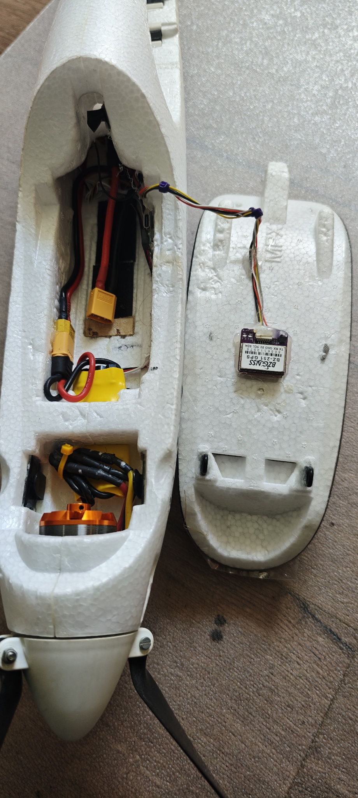

# 🛰️ Modell-Setup: Multiplex Heron (2,4m E-Segler)

Dieses Verzeichnis enthält die iNAV-Flugsteuerungskonfiguration und die 
passenden Modelldateien für den 4-Klappen-Segler **Multiplex Heron**. 

### 🎯 Die 4 Hauptziele dieses Systems:

* 🛡️ **SICHER HEIMBRINGEN**
  > Vollautomatische Rückkehr zum Startplatz bei Raumlage- oder Sichtverlust.

* 🦅 **UNTERSTÜTZEN (FOKUS)**
  > Maximale Entlastung des Piloten durch die Thermik-Kreisflug-Automatik.

* ⚖️ **STABILISIEREN**
  > Unsichtbarer Ausgleich von Windböen und Turbulenzen im Flugbetrieb.

* 🕹️ **MANUELLER MODUS (RÜCKFALLEBENE)**
  > Volle manuelle Kontrolle auf Schalterdruck. Der Gyro wird komplett 
  > deaktiviert, sodass der Segler direkt, ungefiltert und klassisch fliegt.

---

# 🛰️ Modell-Setup: Multiplex Heron (2,4m E-Segler)

## 💡 Die Besonderheiten und Flugfunktionen im Überblick

Für den Flugbetrieb wurden im iNAV-System folgende aerodynamische Schutzfunktionen 
und Automatismen konfiguriert:

* **Sicherheits-Priorität (Loiter & RTH):** Die Modi **NAV LOITER** (Kreisflug) 
  und **NAV RTH** (Heimkehr) auf **CH 7** haben absolute Priorität. Sie fangen 
  das Modell bei Raumlage- oder Sichtverlust auf Schalterdruck ab.

* **Erlaubtes Steigen:** Die Konfiguration erzwingt keine starre Flughöhe. 
  Findet der Heron im autonomen Kreisflug einen Aufwind, lässt das System es 
  zu, dass das Modell durch die reine Kraft der Thermik nach oben steigt.

* **Seitenruder-Mitnahme im Kreisflug:** Beim autonomen Kreisen (Loiter) steuert 
  das System das Seitenruder automatisch mit. Das verhindert ein Schieben des 
  Modells und unterstützt ein flaches Kreisen.

* **Schutz vor Strömungsabriss (Nase runternehmen):** Um ein Abkippen über die 
  Tragfläche (Stall) bei nachlassender Fahrt zu verhindern, nimmt die Software 
  automatisch die Nase leicht runter, um die Strömung aufrechtzuerhalten.

* **Manuelle Höhenanpassung im Automatikmodus (Tiefenruder):** Wenn das Modell 
  autonom fliegt (RTH oder Loiter), kann der Pilot über das Tiefenruder aktiv 
  eingreifen. Bei gedrücktem Tiefenruder sinkt das Flugzeug gezielt. Wird der 
  Knüppel losgelassen (Wegnehmen), stabilisiert sich der Heron sofort wieder 
  automatisch auf der aktuellen Höhe und das Sinken stoppt.

* **Manuelle Richtungskorrektur (Seitenruder):** Im autonomen Kreisflug reicht 
  ein einmaliger Ausschlag am Seitenruder aus, um die Kreisrichtung oder die 
  Lage des Kreises im Thermikbart anzupassen. Nach dem Loslassen kreist das 
  Modell autonom auf der korrigierten Flugbahn weiter.

* **Echter Manueller Modus (CH 6):** Im Modus `MANUAL` wird der Gyro komplett 
  deaktiviert. Die Fernsteuerung steuert die Servos direkt an – ohne jede 
  Zwischenregelung des FCs.

* **Automatisches Einmessen (Autotrimm):** Die aktivierte Funktion `FW_AUTOTRIM` 
  ermöglicht es, das Modell im stabilen Geradeausflug perfekt mechanisch 
  einzutrimmen. iNAV lernt die Mittenpositionen fliegend ein.

---

## 🎛️ Praxis-Anleitung: Die Schalterbelegung im Flug

Die Steuerung im Alltag erfolgt über zwei Hauptschalter auf den Kanälen 7 und 15 
sowie einen Drehregler auf Kanal 9:

### 1. Der Rettungs- & Sicherheits-Schalter (CH 7)
* **Stellung Oben:** AUS (Manuelle Steuerung)
* **Stellung Mitte:** **NAV LOITER** ➔ Der Heron geht in den autonomen 
  Kreisflug über. Über den Drehregler (**CH 9**) kann der Kreisradius in der 
  Luft stufenlos verengt oder geweitet werden, um das Modell in die Thermik 
  einzuziehen.
* **Stellung Unten:** **NAV RTH** ➔ Der Segler fliegt vollautomatisch zum 
  Startplatz zurück und kreist dort.

### 2. Der 3-Stufen-Klappenschalter (CH 15)
Dieser Schalter steuert die Verwölbung der Tragfläche (Wölbklappen und 
Querruder) für die jeweilige Flugphase:
* **Stellung Oben (Thermik-Phase):** Leichte Negativ-Stellung aller Klappen 
  (Wölbklappen und Querruder fahren minimal nach oben).
* **Stellung Mitte (Normal-Phase):** Neutralstellung (Alle Klappen im Strak).
* **Stellung Unten (Lande-Phase / Butterfly):** Volle Bremsstellung. Die 
  Wölbklappen fahren nach unten, die Querruder nach oben. Die notwendige 
  Tiefenruder-Beimischung wird direkt über den Sender zugemischt.

---

## 📊 3. Kanalbelegung & Schalterfunktionen (Fernsteuerung)

Die Kanäle 1 bis 4 steuern die Hauptfunktionen des Seglers. Die Kanäle 5, 6, 
7, 8, 9, 11, 13 und 15 lesen die Geberstellungen für das iNAV-System ein:

* **CH 1:** Throttle (Gas / Motorregler)
* **CH 2:** Aileron (Querruder)
* **CH 3:** Elevator (Höhenruder)
* **CH 4:** Rudder (Seitenruder)
* **CH 5:** Aus / Arm (Motor scharf)
* **CH 6:** Manual / Soaring + Turn Assist (Thermik-Modus)
* **CH 7:** Aus / Nav Loiter (Kreisflug) / Nav RTH (Heimkehr)
* **CH 8:** Aus / Nav Cruise + Nav Althold (Streckenflug)
* **CH 9:** Loiter Radius (Live-Regler für den Kreisflug)
* **CH 11:** Klappen Ausschlag
* **CH 13:** Aus / Auto Level Trim (Automatisches Eintrimmen)
* **CH 15:** Klappen Modus

---

## 📻 4. Anschluss von Empfänger, GPS und Telemetrie

Die Funk- und Navigationskomponenten werden wie folgt am SpeedyBee F405 Wing 
verkabelt und betrieben:

* **FrSky-Empfänger (Steuersignal):** 
  Der Empfänger wird direkt am ersten Kontakt der Stiftleiste angeschlossen. 
  Das digitale Steuersignal läuft im iNAV-System starr über den **UART 2** 
  (aktiviertes `Serial RX`).
* **GPS-Modul:**
  Das GPS-Modul für die Standortdaten ist an den Anschlüssen von **UART 3** 
  (Spalte *Sensors* ➔ *GPS*) zugewiesen.
* **Telemetrie-Rückkanal (Tele Out):**
  Die Rückübertragung der Flugdaten zum Sender (SmartPort) ist physisch an 
  **Port 4 (seitlicher Stecker)** angeschlossen. Softwareseitig läuft diese 
  Übertragung über den emulierten Port **`SOFTSERIAL1`** (Spalte *Telemetry* 
  ➔ *SmartPort*).

### 📸 Ansicht der Anschlüsse und Verkabelung:

*Physischer Anschluss des FrSky-Empfängers und des GPS-Moduls am Flight Controller.*

---

## 🔌 5. Physische Belegung der Ausgänge (Stiftleisten)

Verkabeln Sie die Komponenten Ihres Multiplex Heron exakt nach diesem Schema an 
den Stiftleisten des SpeedyBee F405 Wing:

* **`Stiftleiste 1`:** Anschluss für den FrSky-Empfänger (Signal, Strom, Masse)
* **`Stiftleiste 2`:** Hauptmotor / Regler (ESC) ➔ (Gaskanal)
* **`Stiftleiste 3`:** Wölbklappe ➔ `smix 1` / `smix 6` / `smix 7`
* **`Stiftleiste 4`:** Höhenruder ➔ `smix 2` (Höhenkanal)
* **`Stiftleiste 5`:** Seitenruder ➔ `smix 0` / `smix 3` (Seitenkanal)
* **`Stiftleiste 6`:** Wölbklappe ➔ `smix 4` / `smix 5`
* **`Stiftleiste 7`:** Querruder Links ➔ (Standard iNAV-Flächenmischer)
* **`Stiftleiste 8`:** Querruder Rechts ➔ (Standard iNAV-Flächenmischer)

### 📸 Ansicht der Stiftleisten-Belegung:

*Die am SpeedyBee F405 Wing angesteckten Ruderservos und der Regler des Herons.*

---

## 📦 Inhalt dieses Ordners

1. **`heron_inav_cli.txt`:** Der fertige iNAV-CLI-Dump mit allen oben genannten 
   aerodynamischen Filtern, Logikschaltern und Mischern.
2. **`heron_edge_tx.yml`:** Die fertige Modelldatei für Ihre RadioMaster TX16S 
   inklusive vorkonfigurierter Schalterbelegung für alle Flugphasen.
