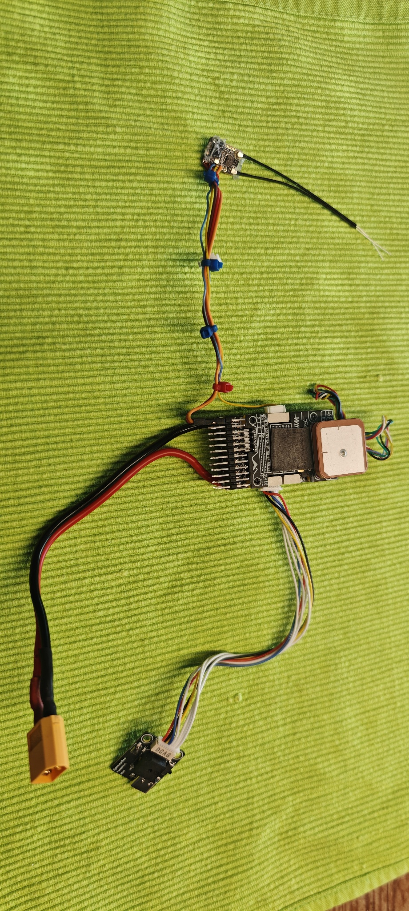
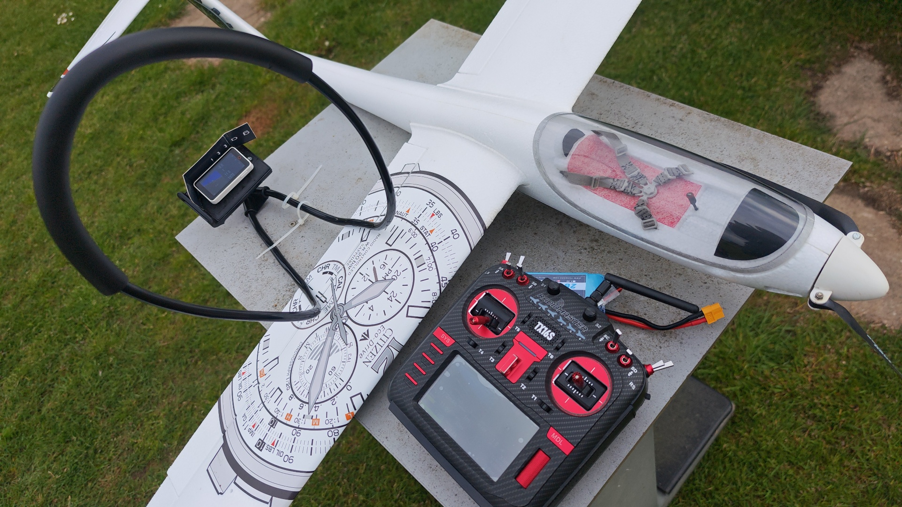

# Flugstabilisierungs- und Rettungssystem für RC-Segelflugzeuge
### (Autonomous Stabilization, Return-to-Home & Thermic Assist for Gliders)

Dieses Open-Source-Projekt realisiert ein autonomes Sicherheits- und 
Assistenzsystem für RC-Segelflugzeuge, Motorsegler und Flächenmodelle. 
Es basiert auf der Anpassung der iNAV-Flugsteuerung (z. B. auf 
SpeedyBee F405 Wing oder Corewing Hardware-Boards).

Das System richtet sich gezielt an klassische Modellsegelflieger, die 
bisher keine Berührungspunkte mit Multirotor- oder Drohnentechnologien hatten.

---

## Mechanischer Aufbau & Ansichten

*Der Flugcontroller mit GPS-Empfänger huckepack, Mini-Empfänger und USB-Modul / 
Beeper. Das Kabel zum Akku ist angelötet, das Kabel zum Regler fehlt noch.*

---

## Die realen Risiken beim Segelfliegen

Klassische Segelflugmodelle repräsentieren oft einen sehr hohen finanziellen 
und zeitlichen Wert. Im Flugbetrieb kommt es regelmäßig zu Stresssituationen:

* **Dauerhafter Sichtkontakt-Zwang:** Der Pilot ist ständig gezwungen, das 
  Modell zu beobachten. Ein kurzer Blick auf den Sender oder das Entspannen 
  der Nackenmuskulatur ist oftmals kritisch.
* **Raumlageverlust bei schlechter Sicht:** Dunst, starkes Gegenlicht, weite 
  Entfernungen oder das unbeabsichtigte Einfliegen in Wolkenfetzen führen 
  in Sekunden zum totalen Verlust der Fluglage-Erkennung.
* **Risiko des Wegfliegens:** Ohne Sichtkontakt fliegt das Modell unkontrolliert 
  weiter, was den totalen Verlust des wertvollen Modells bedeutet.
* **Gefährdung durch Absturz:** Verliert das Modell die Eigenstabilität oder 
  gerät in eine unklare Fluglage, kann es unkontrolliert abstürzen. Ein 
  unkontrolliert abstürzendes Modell stellt eine erhebliche physische 
  Gefährdung für Personen, Sachen und den Luftraum am Boden dar.

---

## Der Lösungsansatz: Die Flugsteuerung als Sicherheits-System

Durch den Einbau einer kompakten Wing-Flugsteuerung zwischen Empfänger und 
Servos wird das System zum unsichtbaren Co-Piloten und zur Lebensversicherung:

1. **Rettungsfunktion bei unklarer Fluglage:** Per Schalterdruck bringt die 
   Software den Segler im Bruchteil einer Sekunde vollautomatisch in eine 
   stabile, waagerechte Fluglage. Der Absturz wird verhindert, die Gefahr am 
   Boden abgewendet und der Pilot kann durchatmen.
2. **Coming Home Funktion (RTH / Rückkehr):** Bei akutem Sichtverlust oder 
   Funkausfall wendet der Segler selbstständig, fliegt zum Startplatz zurück 
   und kreist dort sicher auf einer festgelegten Höhe, bis der Pilot wieder 
   Sichtkontakt hat und manuell übernimmt. Ein Wegfliegen ist unmöglich.
3. **Thermikunterstützung (Kreis-Assistent):** Der FC hält über seine Sensorik 
   (Barometer/GPS) auf Wunsch eine exakte Schräglage und konstante Fahrt. Das 
   zentrierte Kreisen in Aufwinden wird dadurch massiv erleichtert.
4. **Allgemeine Wind-Stabilisierung:** Automatisches Ausgleichen von böigem 
   Wind und Turbulenzen sorgt für ein ruhiges Flugbild.
5. **Manueller Modus:** Manuelle Steuerung ohne Unterstützung durch den Gyro.
6. **Startunterstützung beim Wurf:** Der FC erkennt den Wurf und steuert das 
   Modell auf eine stabile Flughöhe, bis der Pilot die Kontrolle übernimmt.
7. **Akustische Warnmeldungen:** Der FC erkennt technische Defekte sowie 
   unsichere Startparameter (wie Unterspannung oder fehlende GPS-Synchronisation) 
   und meldet diese über ein akustisches Beepen.
8. **Einfache Konfiguration auf dem Platz:** Konfiguration durch Mobiltelefon oder PC.
9. **Automatische Trimmen:** Trimmung im Flug bei Bedarf oder dauerhaft.
---

## Minimaler Aufwand durch vordefinierte Setups

Die manuelle Einarbeitung, Konfiguration und das anschließende Testfliegen von 
iNAV auf Flächenmodellen ist zeitaufwendig und für viele Piloten abschreckend. 
Dieses Projekt nimmt Ihnen diese Arbeit weitestgehend ab.

Der geringe Aufwand in der Praxis entsteht durch fertige Einstellungs-Setups:

* **Vordefinierte Profile:** Sie laden ein praxiserprobtes Gesamt-Setup 
  (CLI-Dump) direkt auf Ihre Flugsteuerung. Die gesamte grundlegende 
  Mischer- und Stabilisierungslogik ist darin bereits fertig programmiert.
  
* **Geringe Restanpassung:** Sie müssen das Setup lediglich an drei Punkten 
  auf Ihr individuelles Modell anpassen:
  
  Das genutzte Senderprotokoll einstellen  
     *(CRSF, SBUS, IBUS, FPORT, SRXL2, DSM2, DSMX, GHST, MAVLINK, JETIEXBUS)*  
     *(Kompatibel mit TBS, ExpressLRS, FrSky, FlySky, Spektrum, Futaba, Graupner)*
     
  Die Ruderlagen (Mitte) kontrollieren, damit die Klappen gerade stehen.
  
  Die maximalen Ruderausschläge und Richtungen an Ihre Mechanik angleichen.

---

## Projekt-Dokumentation & Modell-Setups

Dieses Projekt ist modular aufgebaut, um den Einstieg so einfach wie möglich 
zu gestalten.

➔ **[Hier geht es zu den Anleitungen (Anleitungen.md)](Anleitungen.md)**

---

## Ziel dieser Seite

Ziel ist es, eine Plattform für seglerspezifische Controller-Einstellungen zu 
bieten. Es sollen verschiedene Mustervorlagen entstehen.

Ein Informationsaustausch ist über RC-Network geplant.

Viel Spaß beim Lesen und Nachbauen!

---

## Segler, Fernbedienung, optionale Telemetrieanzeige mit Nackenstütze

*Nicht zwingend notwendig, aber ein Blick wie weit die Reise gehen kann:*  
Über die [Bluetooth Bridge](https://github.com/Networker-001/TX16s-Bluetooth-Bridge) 
werden die autonomen iNAV-Fluglagendaten und der Thermik-Status live per Funk 
an das Teleview-Display an der Fernsteuerung oder an die kartenbasierte 
[Telemetry Viewer App](https://play.google.com/store/apps/details?id=crazydude.com.telemetry&hl=de) 
übertragen.

---

## Lizenz

**MIT License** - Frei für alle Freunde von EdgeTX und des Segelflugs!
